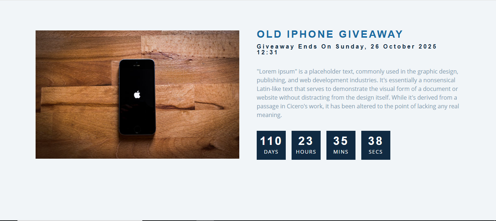

# 🎁 Countdown Giveaway

A simple and interactive countdown timer for a product giveaway, showing days, hours, minutes, and seconds left until the end date. Built using **HTML**, **CSS**, and **JavaScript**, with a responsive and clean UI.

## 📸 Demo

## ✨ Features

- Live countdown timer for a specified future date
- Responsive design — works on mobile, tablet, and desktop
- Dynamic text updates when the giveaway expires
- Styled with CSS variables and modern layout
- Accessible and lightweight — no dependencies except Font Awesome (CDN)

Project Structure

/countdown-giveaway
│

- ├── index.html # Main HTML file
- ├── style.css # Stylesheet
- ├── script.js # Countdown functionality
- ├── gift.jpeg # Giveaway product image
- └── README.md # Documentation
